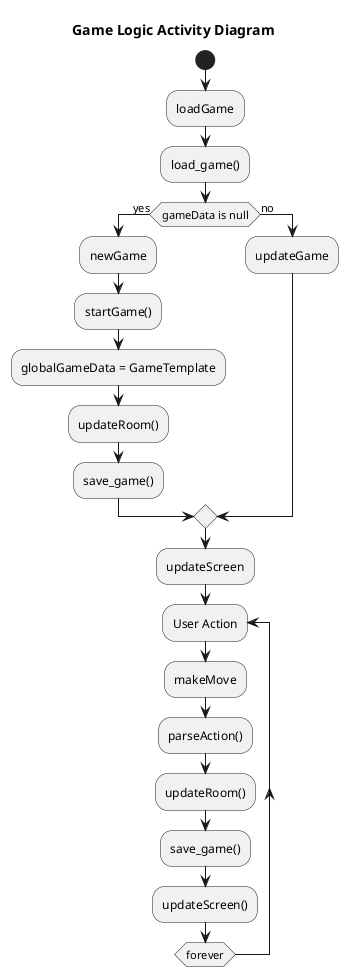
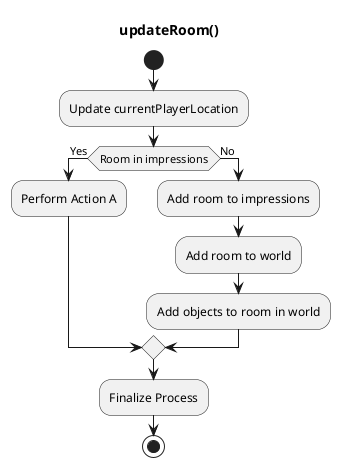

# Text Based Adventure Framework

TBD

```plantuml
@startuml
title Game Logic Activity Diagram

start

:loadGame;
:load_game();
if (gameData is null) then (yes)
    :newGame;
    :startGame();
    :globalGameData = GameTemplate;
    :updateRoom();
    :save_game();
else (no)
    :updateGame;
endif

:updateScreen;

repeat :User Action;
:makeMove;
:parseAction();
:updateRoom();
:save_game();
:updateScreen();
repeat while (forever)

@enduml
```

The first problem we want to solve is logic for updating a room.

```plantuml
@startuml
title updateRoom()

start

:Update currentPlayerLocation;

if (Room in impressions) then (Yes)
  :Perform Action A;
else (No)
  :Add room to impressions;
  :Add room to world;
  :Add objects to room in world;
endif

:Finalize Process;
stop

@enduml
```
